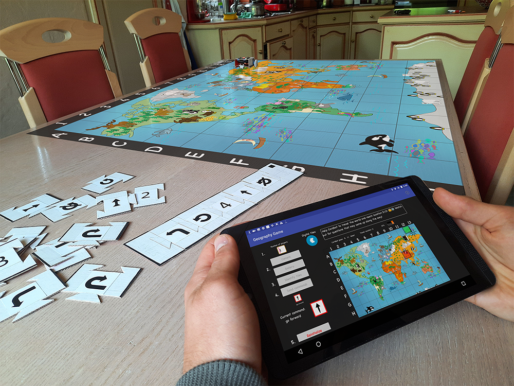

# CaPL

## Version: 1.0.0

 * Author: Anthony Guinchard
 * Institution: EPFL
 * App based on the micro:bit Blue app from Martin Woolley

__Description:__ 

Research conducted in recent years showed that the use of tangible platforms for teaching the basics of programming to children can improve their engagement, interest and collaboration. An important drawback of these robotics educational platforms, however, is that they might be expensive and a lot of schools are not able to afford them. In 2019, EPFL developed two accessible tangible programming language systems: Thymio TPL and Thymio PaPL.

As part of my first semester project in Spring 2020, I took part in the development of a new low-cost and accessible tangible programming language based on cardboard. This project was hence called Cardboard-based Programming Language (CaPL). Based on the micro:bit Blue Android app made by Martin Woolley (a senior British developer and Bluetooth expert), this application is the cornerstone of the CaPL project. Its main purpose is to enable communication between the cardboard-based robot, called Cardbot, and the CaPL tangible programming tiles. In addition, the CaPL app provides also different kinds of feedback regarding the execution of the code by the Cardbot. It is composed of several activities among which the most interesting are:

- The "Free Game"
- The "Geography Game"
- The "Easter Egg"

More details regarding the functionalities of each of these activities are given in the respective "info" menu of the capl-app.
The work presented here provides a base for future Android activities around the Cardbot and other micro:bit-based robots. Moreover, the Android activities can be easily adapted to various age groups by, for instance, changing the displacement costs of the robot in the "Geography Game", by including new rules or by implementing more advanced MCQs. 

The capl-framework-app provides a framework for adapting the CaPL project to different types of robots not specifically based on micro:bit. By following the documentation in "Guinchard_A_CaPL-framework-documentation.pdf" file, developers can easily understand which parts of the code need to be adapted to interface other robots (e.g. Thymio) via Bluetooth.

The key elements of the project are presented in this video: https://www.youtube.com/watch?v=SX8Q3Wv9Q3Q&t=59s

Here is a short article in French from the Roteco website summarizing the whole CaPL project: https://www.roteco.ch/fr/nouveautes/programmation-dun-robot-avec-des-blocs-en-carton-et-une-application-android/

Finally, here is the recording of my final semester project presentation: https://youtu.be/kO5qkA_hCcY

## Contributing

Pull Requests are not being accepted at this time. If you want however to use some part of this code for your personal project, you are free to use it. Be just sure to mention the fact that the original code comes from the micro:bit Blue app from Martin Woolley (https://github.com/microbit-foundation/microbit-blue)

Thank you